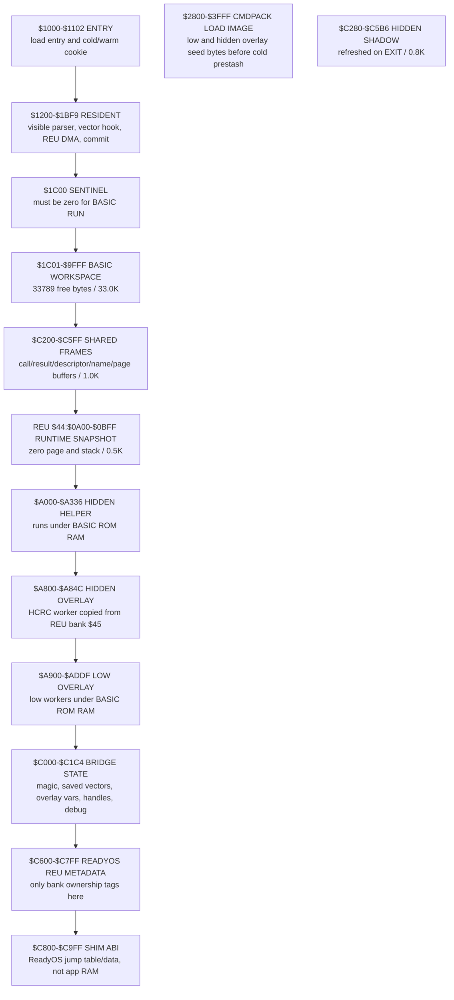
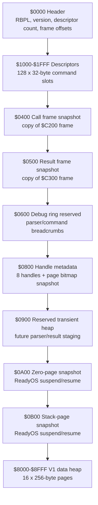
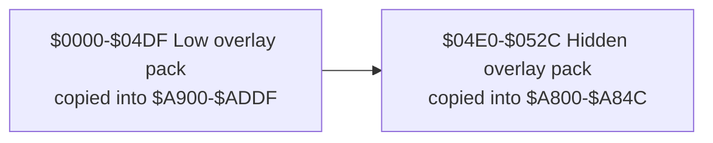
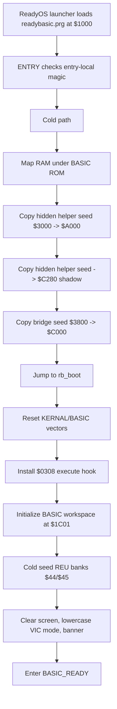
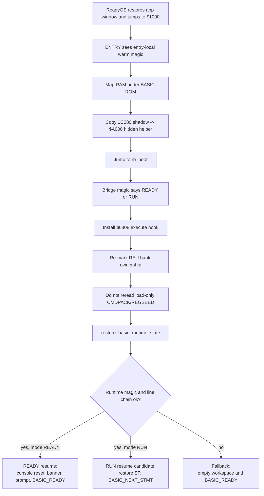
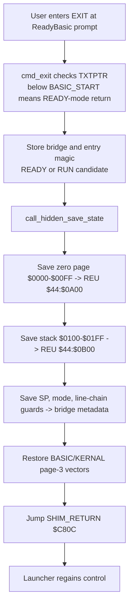
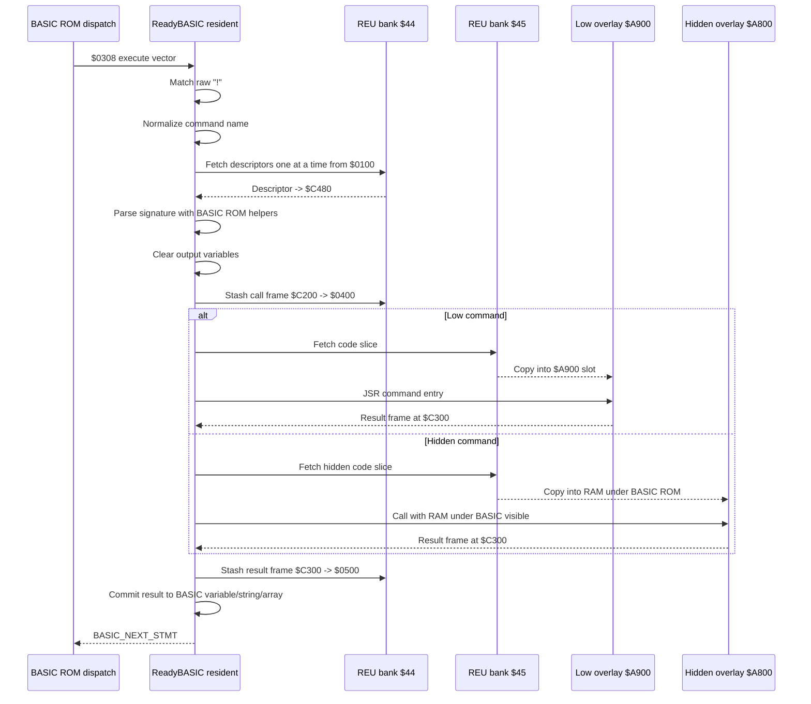
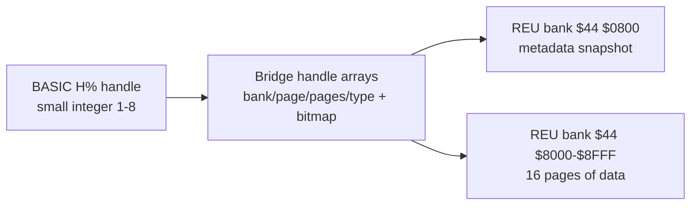

# ReadyBASIC Lifecycle And REU Architecture Deep Dive

This document describes the current ReadyBASIC REU plugin spine as implemented
in `src/apps/readybasic/readybasic.s` and linked by
`cfg/ready_app_readybasic.cfg`. It focuses on lifespan management: initial
loading, cold setup, command dispatch, REU prestash, overlay execution, result
commit, `EXIT`, and warm suspend/resume.

Current evidence base:

- `src/apps/readybasic/readybasic.s`
- `cfg/ready_app_readybasic.cfg`
- `obj/readybasic.map`
- `src/apps/readybasic/READYBASIC_PLUGIN_ARCH.md`
- `src/apps/readybasic/READYBASIC_PLUGIN_PROGRESS.md`
- `src/apps/readybasic/readybasiclessonslearnt.md`
- `src/apps/readybasic/READYBASIC_MICROMODULE_SYNC.md`

## Executive Summary

ReadyBASIC is a ReadyOS app that hosts a relocated C64 BASIC workspace and adds
a raw-text `!COMMAND args` command spine. It is not currently a custom BASIC
token system. Stored lines preserve `!` command text visibly, and the wedge
recognizes it when BASIC dispatches statements through the `$0308` execute vector.
A tiny crunch hook only handles the `IF ... THEN !COMMAND` edge by delegating to
ROM crunch first, then rewriting the real `THEN` token followed by `!` as
`THEN :!` so the normal statement dispatcher is used.

The design is deliberately lean:

- All ReadyBASIC-specific code is assembler.
- The visible resident core is the only code that calls BASIC ROM helpers.
- Command implementations are packed in REU bank `$45` and copied into a small
  overlay slot only when needed.
- Registry, call-frame, result-frame, handle metadata, and persistent sample
  heap state live in fixed REU bank `$44`.
- BASIC string heap mutation happens only in visible resident code after a
  command succeeds.
- Hidden `$A000` code is used only when the CPU banking contract is explicit and
  restored immediately afterward.

The current map confirms this layout:

| Segment | Runtime range | Size | Role |
|---|---:|---:|---|
| `ENTRY` | `$1000-$1102` | `$0103` (259B) | App entry, cold/warm discriminator, early copies. |
| `RESIDENT` | `$1200-$1BF9` | `$09FA` (2554B) | Visible parser, ROM calls, REU DMA wrappers, result commit. |
| `REGSEED` | `$5000-$600F` | `$1010` (4112B) | Load-only registry header and 128 command descriptors used on cold seed. |
| `HIDDEN` | `$A000-$A336` | `$0337` (0.8K) | Hidden helper routines under BASIC ROM. |
| `HIDDENPACK` | `$A800-$A84C` | `$004D` (77B) | Hidden worker overlay image, loaded to REU bank `$45`. |
| `LOWPACK` | `$A900-$ADDF` | `$04E0` (1248B) | Banked low overlay image under BASIC ROM, loaded from REU bank `$45`. |
| `BRIDGE` | `$C000-$C1C4` | `$01C5` (453B) | Persistent bridge/state bytes, no general scratch. |

## Technical Philosophy

ReadyBASIC treats BASIC as a live ROM interpreter with fragile state, not as a
stateless command shell. The main rule is that **BASIC-facing work happens in
visible resident RAM, and worker code stays dumb**.

That rule has several consequences:

- Parameter parsing uses BASIC ROM helpers from visible RAM:
  - `CHKCOM`
  - `FRMNUM`
  - `GETADR`
  - `PTRGET`
- Output variable references are captured before command execution.
- Output variables are cleared before command execution so failure does not show
  stale data.
- Overlays write only a compact result frame.
- The resident core commits results after success, including string heap writes.
- Hidden workers do not allocate BASIC strings.
- REU stores code and metadata, but the live BASIC interpreter state remains in
  C64 RAM and is protected by the ReadyBASIC suspend/resume snapshot.

The V1 spine intentionally avoids a few attractive but expensive abstractions:

- No generic object/value VM.
- No nested value serialization.
- No per-command REU bank.
- No command-per-bank storage.
- No private command token or custom lister yet.
- Only a tiny post-ROM-crunch `THEN !` normalizer is installed.
- No generalized signature bytecode interpreter yet; signatures are dispatched
  by compact hand-written routines.

## Full RAM Layout

The ReadyOS app working region is `$1000-$C5FF`; `$C600-$C7FF` is shared
ReadyOS REU metadata and `$C800-$C9FF` is shim ABI territory. ReadyBASIC must
live inside that contract while also hosting BASIC.



### Load Image Versus Runtime Image

The PRG load address is `$1000`. The linker emits a larger load image than the
runtime-visible resident core:

| Load-time range | Purpose |
|---:|---|
| `$1000-$11FF` | Entry image, including entry-local warm cookie. |
| `$1200-$1BFF` | Resident core image. |
| `$1C00-$27FF` | Padding in the PRG load image; after cold setup, BASIC uses `$1C01+`. |
| `$2800-$3FFF` | Command pack seed bytes, copied to REU bank `$45` only on cold entry. |
| `$4000+` | Hidden helper seed bytes, copied to `$A000` and the visible `$C280` shadow. |
| `$4800+` | Bridge seed bytes, copied to `$C000`. |
| `$5000-$600F` | Registry seed bytes, copied to REU bank `$44` only on cold entry. |

After cold setup, BASIC owns `$1C01-$9FFF`. This is why warm resume must **not**
try to reread the load-only seed tables at `$2800+`, `$4000+`, `$4800+`, or
`$5000+`: that memory may now be BASIC program or variable storage.

## REU Layout

ReadyBASIC reserves two fixed REU banks:

- Bank `$44`: ReadyBASIC common/system storage.
- Bank `$45`: packed command-code storage.

The mirrored ReadyOS type constants are:

| Type | Value | Meaning |
|---|---:|---|
| `REU_RB_CORE` | `14` | ReadyBASIC core/system bank. |
| `REU_RB_CODE` | `15` | ReadyBASIC packed command-code bank. |

ReadyBASIC marks these in the ReadyOS REU allocation table at `$C600+$44` and
`$C600+$45`. It does not treat `$C600` as general app scratch.

### Bank `$44`: Common/System Bank



V1 persistent sample buffers use the data heap in bank `$44`, pages `$80-$8F`.
Each handle records a bank, starting page, page count, type, and bitmap
ownership. Type `1` is a byte buffer, and type `2` is a screen text+color
buffer. This is a compact proof of handle lifecycle, not the final large-data
allocator. Future large or long-lived command data should move into additional
dynamic banks and keep handles as the stable reference.

### Bank `$45`: Packed Command-Code Bank



The descriptor stores offsets and sizes inside bank `$45`. Normal low commands
copy only their own slice. Heap commands currently copy the whole low pack
because their wrappers call shared allocator helper routines in the same packed
low segment.

## Descriptor ABI

Each command descriptor is 32 bytes:

| Offset | Field |
|---:|---|
| `0` | Command id. |
| `1` | Flags: low, hidden, or both. |
| `2-3` | Low code offset in REU bank `$45`. |
| `4-5` | Low code size. |
| `6-7` | Hidden code offset in REU bank `$45`. |
| `8-9` | Hidden code size. |
| `10-11` | Low entry offset from `$A900`. |
| `12-13` | Hidden entry offset from `$A000`. |
| `14` | Signature id. |
| `15` | Uppercase command-name length. |
| `16-31` | Uppercase command-name bytes, zero padded. |

The current descriptors are seeded from `REGSEED` during cold boot and copied
to bank `$44` offset `$1000`. Lookup fetches 256-byte pages, scans eight
descriptors per page, and treats zero-filled filler descriptors as empty slots.

## Cold Boot Lifecycle



The cold setup performs these important operations:

1. It copies hidden helper code before BASIC owns `$1C01+`.
2. It stores a visible shadow copy at `$C280` because `$A000` code cannot be trusted
   after a ReadyOS app switch.
3. It copies bridge state to `$C000`.
4. It resets KERNAL and BASIC vectors, then installs only the execute vector
   hook at `$0308/$0309`.
5. It relocates BASIC:
   - `TXTTAB = $1C01`
   - `VARTAB = ARYTAB = STREND = $1C03`
   - `FRETOP = MEMSIZ = $A000`
   - KERNAL memory bottom/top = `$1C00/$A000`
6. It clears `$1C00`, `$1C01`, and `$1C02`. The `$1C00` byte is a hard
   invariant: C64 BASIC `RUN` expects the byte before `TXTTAB` to be zero.
7. It seeds REU bank `$44` and `$45`.
8. It draws the ReadyBASIC banner and enters `BASIC_READY`.

## Warm Resume Lifecycle



Warm resume is intentionally different from cold boot:

- It restores the hidden helper from `$C280`, not from the old load image.
- It reinstalls ReadyBASIC-owned vectors.
- It re-marks REU ownership for `$44/$45`.
- It does **not** rebuild the registry/code banks from load-only RAM.
- It restores BASIC stack and zero page from REU bank `$44` offsets `$0A00/$0B00`.
- It resets KERNAL memory bounds, but it does not reset live BASIC pointers such
  as `FRETOP`, `VARTAB`, `ARYTAB`, or `STREND`.
- READY-mode resume clears/redraws the screen so the launcher menu does not
  remain visible underneath a BASIC prompt.

## EXIT And Suspend Management

The supported V1 return path is manual prompt `EXIT`. The execute hook detects
`EXIT` before falling back to ROM BASIC.



The vector restore is not optional. Page-3 vectors are global machine state, not
ReadyOS app-private RAM. If ReadyBASIC yielded with `$0308` still pointing into
its resident core, the launcher or another app could dispatch through stale
ReadyBASIC state.

The runtime snapshot lives here:

| Range | Meaning |
|---:|---|
| REU `$44:$0A00-$0AFF` | Saved zero page. |
| REU `$44:$0B00-$0BFF` | Saved hardware stack page. |
| Bridge metadata | Runtime magic, saved SP, resume mode, line-chain validation. |
| `$C280-$C5B6` | Hidden helper shadow, refreshed during `EXIT`. |

## Raw ! Dispatch

ReadyBASIC installs the BASIC crunch and execute vectors:

- Save originals from `$0304-$0309`.
- Install `rb_crunch` into `$0304/$0305`.
- Install `rb_execute` into `$0308/$0309`.
- Leave the list vector forwarding to ROM behavior for V1.

The dispatch rule is:

1. Crunch delegates to ROM BASIC, then inserts `:` before `!` only after a
   tokenized `THEN`.
2. Execute peeks at the next non-space byte without advancing `TXTPTR`.
3. If it is not `!` or `EXIT`, tail-call the saved ROM execute vector.
4. If it is `!`, advance through the raw bang and parse a ReadyBASIC
   command name.
5. If it is `EXIT`, take the ReadyOS yield path.

This is why `LIST` still shows `!COMMAND args`: there is no private token to
hide or pretty-print.

The command name parser normalizes:

- Host/lowercase ASCII command bytes to uppercase.
- Shifted uppercase/PETSCII-like `$C1-$DA` bytes by subtracting `$80`.
- A couple of BASIC token bytes (`FN`, `FRE`) if ROM tokenization produces them
  inside a name.

That last detail exists because ASCII/lowercase/PETSCII/tokenized BASIC input
is a real source of C64 wedge bugs.

## Command Execution Pipeline



### Shared Frames In Low RAM

| Frame | Address | Contents |
|---|---:|---|
| Call frame | `$C200` | Command id, parameter count, numeric slots, pointer/count slots, string buffer. |
| Result frame | `$C300` | Status, error, value tag, scalar value, string buffer, array buffer. |
| Descriptor buffer | `$C480` | One 32-byte descriptor fetched from REU bank `$44`. |
| Command buffer | `$C4A0` | Normalized command name. |
| Page buffer | `$C500` | 256-byte fill/stash buffer for handle operations and warm-resume stack staging. |

The call and result frames are also mirrored to REU bank `$44` offsets `$0400`
and `$0500`. This gives crash/debug visibility and gives future worker models a
stable mailbox shape.

## Parameter And Result Semantics

V1 supports the sample command signatures directly:

| Input kind | Implementation rule |
|---|---|
| Numeric expression | `CHKCOM`, `FRMNUM`, `GETADR`; stores 16-bit value from `LINNUM`. |
| Integer output variable | `PTRGET`, require numeric/integer, clear two bytes before execution. |
| String input | String variable descriptor or quoted literal, max 64 bytes copied to call frame. |
| String output variable | `PTRGET`, require string, clear descriptor before execution. |
| Integer array input | Require explicit base element and count, e.g. `A%(0),N`. |
| Integer array output | Require explicit base element and count from prior argument. Clears destination first. |
| REU handle | V1 handle is represented as an integer variable/value. |

Result tags are:

| Tag | Meaning |
|---:|---|
| `0` | none |
| `1` | integer |
| `2` | string |
| `3` | integer array |

If `RF_STATUS` is nonzero, ReadyBASIC prints `?RB ERROR n` and returns to
`BASIC_READY`. On a clean result, resident code commits to the captured output
reference.

String output is special: overlays stage bytes into `RF_STR_BUF`, then resident
code allocates from the BASIC string heap by lowering `FRETOP`. This is the
correct side of the contract because only resident visible code should mutate
BASIC's string heap.

## Command Inventory

| Command | Code placement | REU code bytes copied | Parameters | Result behavior |
|---|---|---:|---|---|
| `!PING OUT%` | Low overlay at `$A900+$0000` | `$0015` (21B) | output int | Returns `1`. |
| `!ADD16 A,B,OUT%` | Low overlay at `$A900+$0015` | `$001E` (30B) | two numeric expressions, output int | Returns 16-bit sum. |
| `!STRUP S$,OUT$` | Low overlay at `$A900+$0033` | `$003B` (59B) | string variable or literal, output string | Uppercases staged bytes. |
| `!HCRC S$,OUT%` | Hidden overlay at `$A800` | `$004D` (77B) | string variable or literal, output int | Sums uppercase bytes. |
| `!SUMAI A%(0),COUNT,OUT%` | Low overlay at `$A900+$006E` | `$0044` (68B) | integer array base/count, output int | Sums integer array values. |
| `!RANGEAI START,COUNT,A%(0)` | Low overlay at `$A900+$00B2` | `$003D` (61B) | start/count, output array | Stages consecutive integers. |
| `!BUFNEW LEN,H%` | Low overlay entry `$00EF` | `$04E0` (1.2K) | length, output handle | Allocates persistent buffer pages in bank `$44`. |
| `!BUFFILL H%,BYTE` | Low overlay entry `$00F3` | `$04E0` (1.2K) | buffer handle, byte | Fills buffer handle pages using `$C500` page buffer. |
| `!BUFFREE H%` | Low overlay entry `$00F7` | `$04E0` (1.2K) | handle | Frees any valid handle type and clears metadata. |
| `!TEMPSCRATCH LEN,OUT%` | Low overlay entry `$00FB` | `$04E0` (1.2K) | length, output int | Allocates then frees pages, returns page count. |
| `!FAIL CODE,OUT%` | Low overlay at `$A900+$00FF` | `$001B` (27B) | code, output int | Clears output first, then returns `?RB ERROR code`. |
| `!FREEMEM` | Low overlay at `$A900+$011A` | `$0016` (22B) | none | Prints live free BASIC bytes and refreshes the header. |
| `!SCRCAP H%` | Low overlay entry `$0130` | `$04E0` (1.2K) | output screen handle | Captures screen text and color RAM into a type-2 handle. |
| `!SCRPUT H%` | Slot 128; low overlay entry `$0159` | `$04E0` (1.2K) | screen handle | Restores screen text and color RAM after type validation. |

The heap-oriented commands copy the full `$02F3` low pack because allocator
helpers currently live in the same overlay pack. That is an implementation
choice to keep resident RAM lean; a later pass could split a smaller allocator
resident helper or use finer overlay slices.

## Persistent Handle Model

V1 supports up to eight live handles and a 16-page sample heap.



`BUFNEW` converts byte length to 256-byte pages, finds contiguous free pages,
records type-1 metadata, and returns a one-based handle. `BUFFILL` accepts only
type-1 buffer handles, fills `$C500` with the byte, and stashes it page by page
into bank `$44` at page offsets `$80-$8F`. `SCRCAP` creates a type-2 handle and
stashes screen text plus color RAM; `SCRPUT` validates type `2` before restore.
`BUFFREE` clears both the handle and bitmap for any valid handle type.
`TEMPSCRATCH` proves temporary allocation by marking pages and freeing them
before returning.

This handle model is the right direction for future commands that maintain
screen buffers, network buffers, caches, or large results. The V1 limitation is
that data pages are still inside fixed bank `$44`; long-lived large objects
should allocate additional banks and keep the same small handle as the BASIC
visible reference.

## Hidden Code And Banking Contract

ReadyBASIC uses two kinds of hidden code:

- Hidden helper at `$A000-$A336`.
- Hidden worker overlay at `$A800-$A84C`.

Before calling hidden code, ReadyBASIC:

1. Saves flags.
2. Disables interrupts.
3. Forces the low CPU data-direction bits in `$0000` to outputs.
4. Saves `$0001`.
5. Maps RAM under BASIC ROM while keeping KERNAL visible.
6. Performs the copy or call.
7. Restores `$0001`.
8. Restores flags.

That discipline matters because `$0001` is only meaningful when `$0000` drives
the banking bits as outputs. It also matters because hidden code that still uses
KERNAL-visible helpers must not map KERNAL out.

## What Must Stay True

These invariants are the current safety rails:

- ReadyBASIC must be booted through normal ReadyOS profile/run flow, not as a
  standalone app.
- `BASIC_START` stays `$1C01`.
- `$1C00` stays zero before stored-program `RUN`.
- `RESIDENT` stays below `$1C00`.
- `BRIDGE` stays below `$C200`, leaving `$C200-$C5FF` for shared frames.
- `$C600-$C7FF` is ReadyOS REU metadata, not ReadyBASIC scratch.
- `$C800-$C9FF` remains shim ABI.
- Warm resume must restore `$A000` from `$C280` before hidden helper calls.
- Warm resume must not reset `FRETOP`, `VARTAB`, `ARYTAB`, or `STREND`.
- ReadyBASIC-owned vectors must be restored before yielding to ReadyOS.
- Non-ReadyBASIC BASIC statements must tail-call the original `$0308` vector
  without mutated `TXTPTR`.
- String heap writes happen only in resident visible code.
- Acceptance re-entry uses launcher menu navigation, not `CTRL+3`.

## Current Verification

The current full visual suite is:

```sh
READYBASIC_VISIBLE=1 /Users/karlprosserpp/dev/c64projects/agenticdevharness/tools/vice_tasks_dotnet/AGENTWORKING/run_readybasic_full_suite_visual_verification.sh
```

Latest documented pass on the memory-reclaim branch:

- Run dir:
  `/Users/karlprosserpp/dev/c64projects/agenticdevharness/logs/vice_auto_20260521_202657`
- Result: 98/98 steps, `FailedStep: null`, no degraded steps.
- It validates:
  - Cold ReadyOS boot with `READYOS_CONFIG_RUN_FIRST=readybasic`.
  - Direct-mode scalar, string, hidden worker, array, REU handle, temp heap,
    failure, and unknown-command paths.
  - Menu-based launcher round trip and ReadyBasic redraw.
  - BASIC variable/string state plus registry survival after resume.
  - Stored-program `LIST` and `RUN` for the major command families.

## Design Notes For Future Expansion

The current architecture can scale to many commands if the command registry and
code pack remain compact:

- Keep command code packed inside banks, not one bank per command.
- Keep descriptors fixed-size for v1.
- Move large command-private state to dynamic REU banks referenced by small
  BASIC integer handles.
- Consider moving reusable allocator helpers into a separate resident or common
  overlay only if it reduces total copied bytes without bloating resident RAM.
- Add a real crunch/list token path only after its register, length, and lister
  contracts have a dedicated probe.
- Treat program-line `EXIT` resume as future work; manual prompt `EXIT` is the
  proven path.
- Any full-system command that bypasses ReadyBasic's normal completion path will
  need an explicit suspend/resume ABI and likely shim/launcher coordination.
